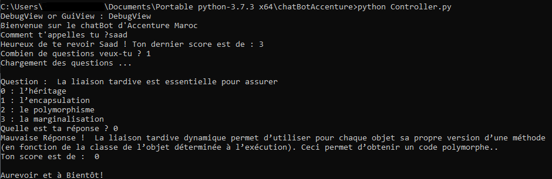
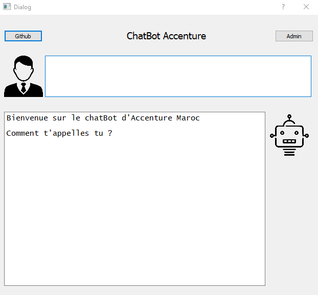
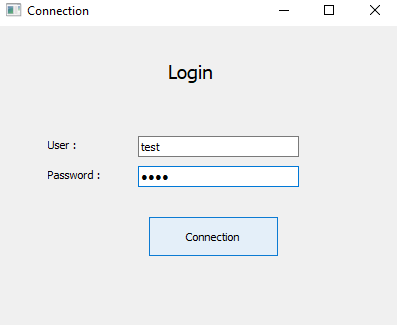
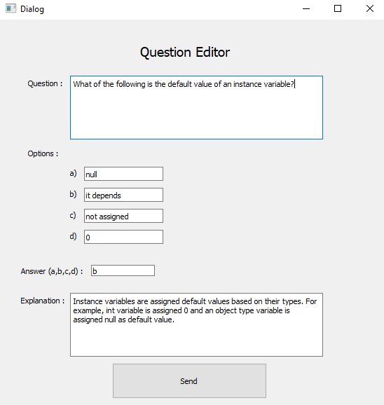

# ChatBot with JAVA Quiz / *ChatBot avec un QCM JAVA*
**This is a ChatBot with a JAVA Quiz you can edit. [Link on GitHub Pages .](https://saadbenda.github.io/ChatBot-With-JAVA-Quiz/)**              
*Ceci est ChatBot avec un QCM JAVA que l'on peut modifier. [Lien sur GitHub Pages .](https://saadbenda.github.io/ChatBot-With-JAVA-Quiz/)*         

## Acknowledgements / *Remerciements*
**A big thank-you to Mr. Hakim and Mr. Haddou Hicham (Supervisors at Accenture Morocco) for their supervisory and their precious advice during the realization of this project.**          
*Un grand merci à Mr. Hakim and Mr. Haddou Hicham (Superviseurs chez Accenture Maroc) pour leur encadrement et leurs précieux conseils durant la réalisation de ce projet*          

## The JAVA Quiz / *Le QCM JAVA*
**The entire quiz has been developed with MVC pattern**     
*L'ensemble du QCM a été codé suivant le pattern MVC*          

### The DebugView / *La DebugView*
**To start the application, write this line `> python Controller.py` on your console. Then choose DebugView**                  
*Pour lancer l'application, écrivez cette ligne `> python Controller.py` dans votre console. Puis choisissez DebugView*        

**The application recognize new users and old ones (e.g. saad)**          
*L'application reconnait les nouveaux utilisateurs et les anciens (ex. saad)*

### The GuiView / *La GuiView*
**To start the application, write this line `> python Controller.py` on your console. Then choose GuiView. You can change the style of the view by opening the .ui files contained in the file 'view' with qt designer for example**                               
*Pour lancer l'application, écrivez cette ligne `> python Controller.py` dans votre console. Puis choisissez GuiView. Vous pouvez changer le style de la vue en ouvrant les fichiers .ui contenues dans le dossier 'view' avec qt designer par exemple*
#### The Main Window / *La fenêtre principale*
**/!\ I did not have time to finish the chat between the bot and the user, I will do it in the next commit**                    
*/!\ Je n'aie malheureusement pas eu le temps de finir la discussion entre le bot et l'utilisateur, je le ferais dans le prochain commit*               

#### The Login / *La Connexion*
**For the demo: the user is 'test' and the password 'test' then click on 'connection'**                       
*Pour la démo: l'utilisateur est 'test' et le mot de passe est 'test' puis cliquez sur 'connection'*

#### The Question Editor/ *l'Editeur de questions*        
**Add the questions you want then click on 'send'**           
*Ajoutez les questions que vous voulez puis clicker sur 'send'*

## Future Commits / *Prochain Commits*
**In the next commits, I will implement a real discussion between the bot and the user so stay tuned !**              
*Dans les prochain commits, j'implémenterai une vraie discussion entre le bot et l'utilisateur donc restez connecté !
